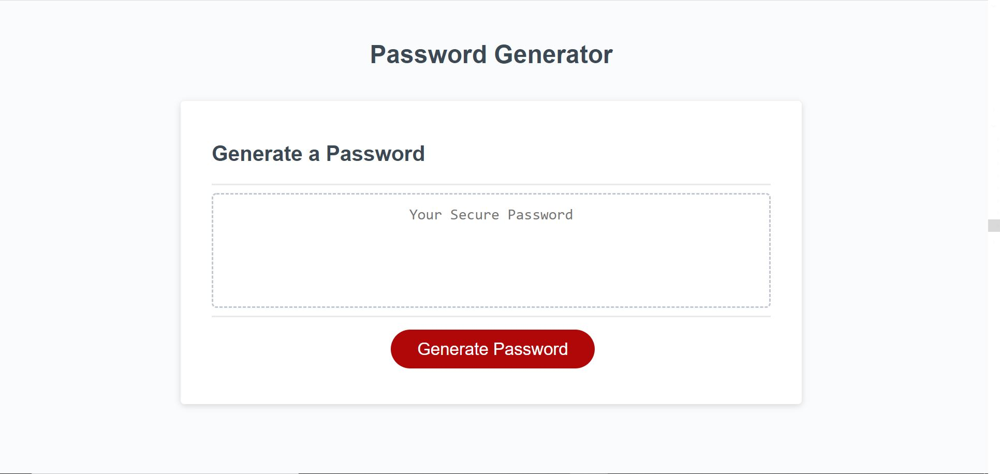

# Password Generator Starter Code

- This is a password generator tool. When you click on the "Generate Password" icon, you get a prompt asking you how much 
length do you want for your password.

- After that, it asks you to select from 4 criterias to generate your password.

- After that, it creates your password and shows it on the screen.

link to deployed application - https://rohanrulz.github.io/Password-Generator/

